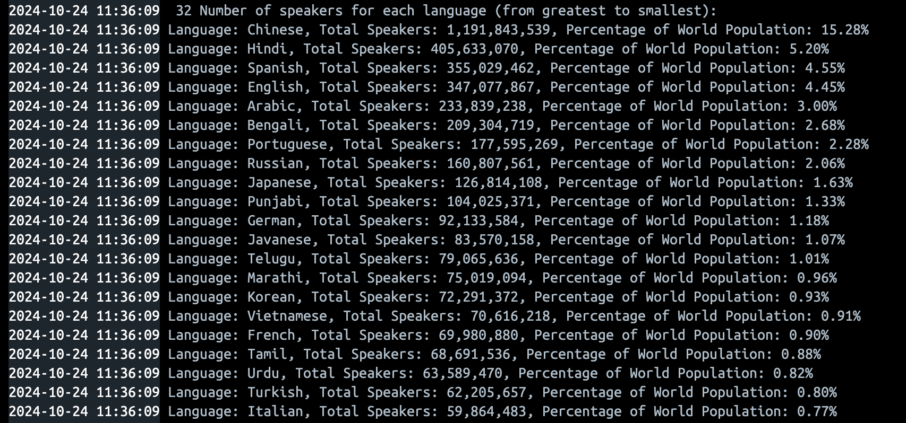

# 🗺️  World Population Data Query

## **Badges** 🚀
- 
- 
- 
- 
- 

## In this Report 📚

We have successfully executed **32 queries** related to populations across various entities such as cities, regions, and continents. The queries include detailed population analysis, ranking, and segmentation based on different criteria.

We also conducted rigorous testing to ensure the correctness and reliability of our results:

- **Unit Testing**: To verify the functionality of individual components and ensure that each query returns the expected results.
- **Integration Testing**: To confirm that the queries and database interactions work seamlessly together as a whole system.

Additional efforts included:

- **Performance Testing**: Ensuring the system performs efficiently with large datasets.
- **Code Optimization**: Streamlining query performance for faster response times.

### **Requirements** ⚙️
1. **JDK 17**: Used for Java development.
2. **Maven**: For project build management and dependency handling.
3. **SQL Docker**: To containerize and manage the SQL database for the project.
4. **GitHub**: For version control and project repository management.
5. **Kanban**: Used for project management and task tracking.

## **Evidence of 32 City, Capital, Population queries** 🌏
| **ID** | **Description**                                                                                              | **Met** | **Screenshot**                               |
|-------|--------------------------------------------------------------------------------------------------------------|--------|---------------------------------------------|
| 1     | All the countries in the world organized by largest population to smallest.                                   | Yes    |             |
| 2     | All the countries in a continent organized by largest population to smallest.                                 | Yes    |             |
| 3     | All the countries in a region organized by largest population to smallest.                                    | Yes    |             |
| 4     | The top N populated countries in the world where N is provided by the user.                                   | Yes    |             |
| 5     | The top N populated countries in a continent where N is provided by the user.                                 | Yes    |             |
| 6     | The top N populated countries in a region where N is provided by the user.                                    | Yes    |             |
| 7     | All the cities in the world organized by largest population to smallest.                                      | Yes    |             |
| 8     | All the cities in a continent organized by largest population to smallest.                                    | Yes    |       |
| 9     | All the cities in a region organized by largest population to smallest.                                       | Yes    |             |
| 10    | All the cities in a country organized by largest population to smallest.                                      | Yes    |            |
| 11    | All the cities in a district organized by largest population to smallest.                                     | Yes    |      |
| 12    | The top N populated cities in the world where N is provided by the user.                                      | Yes    |            |
| 13    | The top N populated cities in a continent where N is provided by the user.                                    | Yes    |            |
| 14    | The top N populated cities in a region where N is provided by the user.                                       | Yes    |            |
| 15    | The top N populated cities in a country where N is provided by the user.                                      | Yes    |            |
| 16    | The top N populated cities in a district where N is provided by the user.                                     | Yes    |            |
| 17    | All the capital cities in the world organized by largest population to smallest.                              | Yes    |            |
| 18    | All the capital cities in a continent organized by largest population to smallest.                            | Yes    |            |
| 19    | All the capital cities in a region organized by largest population to smallest.                               | Yes    |            |
| 20    | The top N populated capital cities in the world where N is provided by the user.                              | Yes    |            |
| 21    | The top N populated capital cities in a continent where N is provided by the user.                            | Yes    |            |
| 22    | The top N populated capital cities in a region where N is provided by the user.                               | Yes    |            |
| 23    | The population of people, people living in cities, and people not living in cities in each continent.         | Yes    |            |
| 24    | The population of people, people living in cities, and people not living in cities in each region.            | Yes    |            |
| 25    | The population of people, people living in cities, and people not living in cities in each country.           | Yes    |            |
| 26    | The population of the world.                                                                                  | Yes    |            |
| 27    | The population of a continent.                                                                                | Yes    |            |
| 28    | The population of a region.                                                                                   | Yes    |            |
| 29    | The population of a country.                                                                                  | Yes    |            |
| 30    | The population of a district.                                                                                 | Yes    |            |
| 31    | The population of a city.                                                                                     | Yes    |            |
| 32    | The number of people who speak the following languages from greatest to smallest, including percentage of the world population. | Yes  |            |

## Code Review and Final Deliverable Scores 👥
| Name                      | Code Review 1 | Code Review 2 | Code Review 3 | Code Review 4 | Final Deliverable |
|---------------------------|---------------|---------------|---------------|---------------|-------------------|
| Shane Bhone Aung (40667681)  | 16.67         | 16.67         | 16.67         | 16.67         | 16.67              |
| Phone Pyae Phyoe (40667681)  | 15.67         | 15.67         | 15.67         | 15.67         | 16.67              |
| Wuna Phyo Paing (40667681)   | 14.67         | 14.67         | 14.67         | 15.67         | 15.67              |
| Lu Phone (40667681)          | 14.67         | 14.67         | 14.67         | 14.67         | 15.67              |
| Kyaw Shinn Thant (40667681)  | 14.67         | 15.67         | 14.67         | 14.67         | 15.67              |
| Phyo Pyae Sone (40667681)    | 14.67         | 14.67         | 14.67         | 14.67         | 15.67              |

